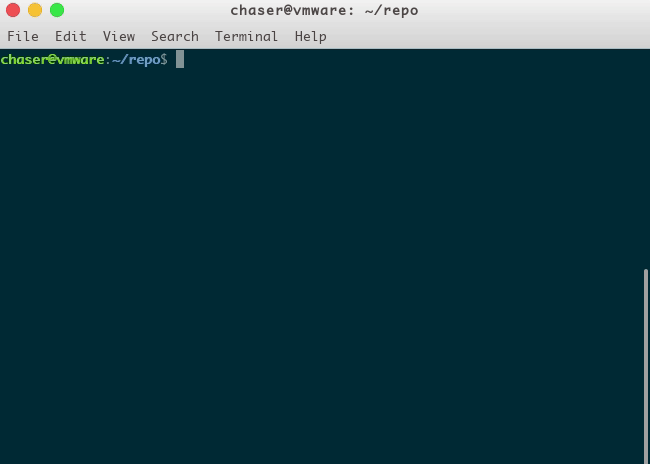

<h1 align="center">Welcome to chaser-cli 👋</h1>
<p>
  <a href="https://www.npmjs.com/package/chaser-cli">
    
  </a>
  <a href="https://github.com/impeiran/chaser-cli#readme">
    
  </a>
  <a href="https://github.com/impeiran/chaser-cli/graphs/commit-activity">
    
  </a>
  <a href="https://github.com/impeiran/chaser-cli/blob/master/LICENSE">
    
  </a>
</p>

> Inspired by vue-cli @2.x

#### preview



#### Install

```sh
 npm install -g chaser-cli
```

#### Usage

use **init** commander to init a project

```bash
# init a project with template
chaser init [projectName]

# example:
# init SaaS project
chaser init SaaS
# init at current directory
chaser init .
```

and then choose a template you like

#### Author

👤 **impeiran**

* Github: [@impeiran](https://github.com/impeiran)

#### 🤝 Contributing

Contributions, issues and feature requests are welcome!<br />Feel free to check [issues page](https://github.com/impeiran/chaser-cli/issues).

#### Show your support

Give a ⭐️ if this project helped you!

#### 📝 License

Copyright © 2019 [impeiran](https://github.com/impeiran).<br />
This project is [ISC](https://github.com/impeiran/chaser-cli/blob/master/LICENSE) licensed.

***
_This README was generated with ❤️ by [readme-md-generator](https://github.com/kefranabg/readme-md-generator)_